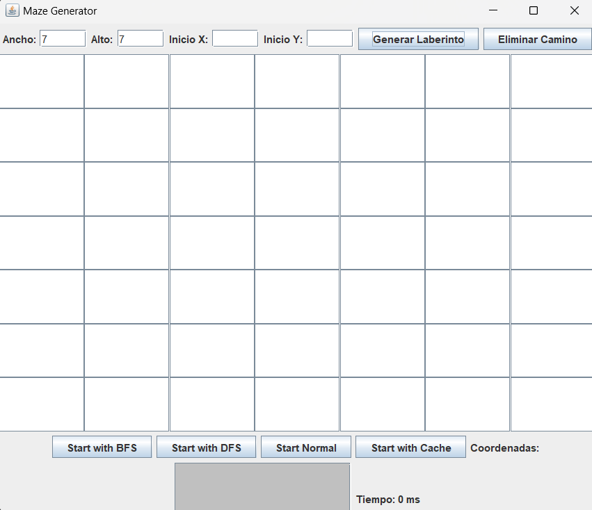
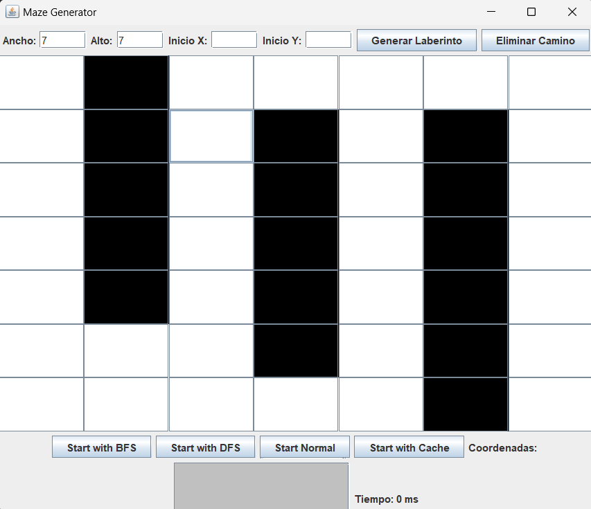
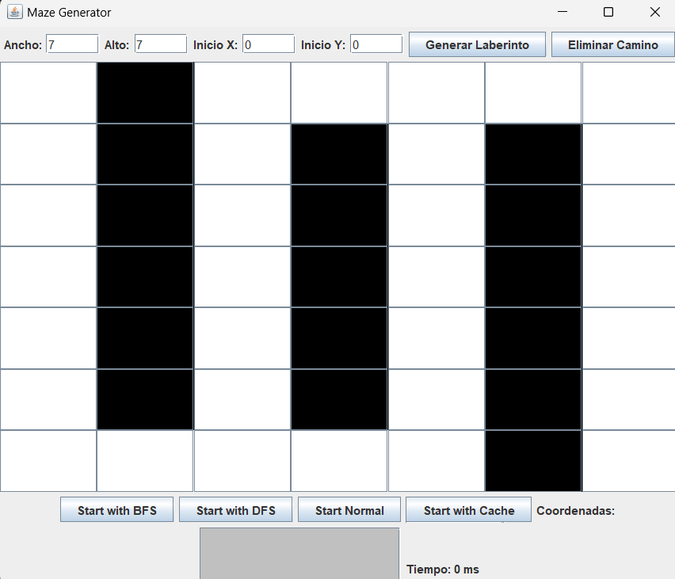
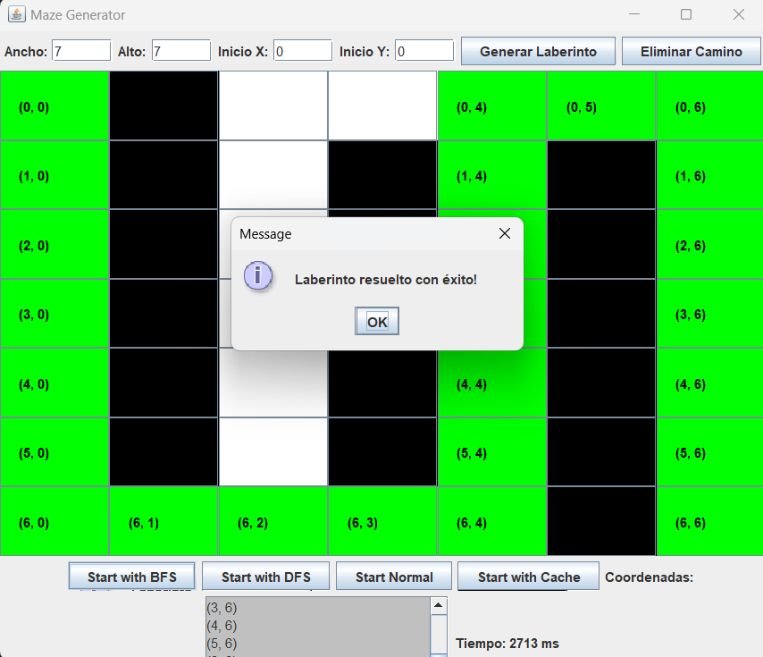
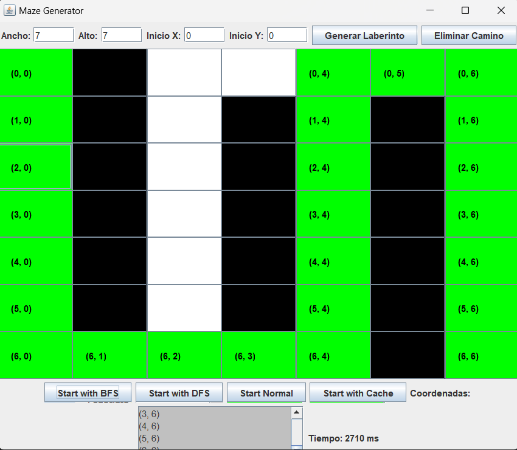
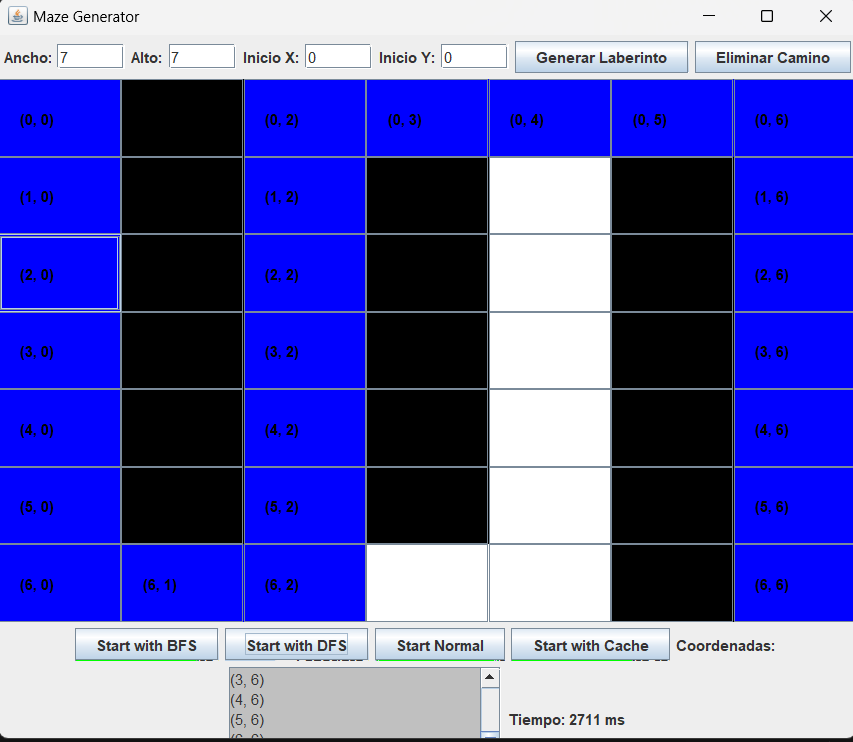
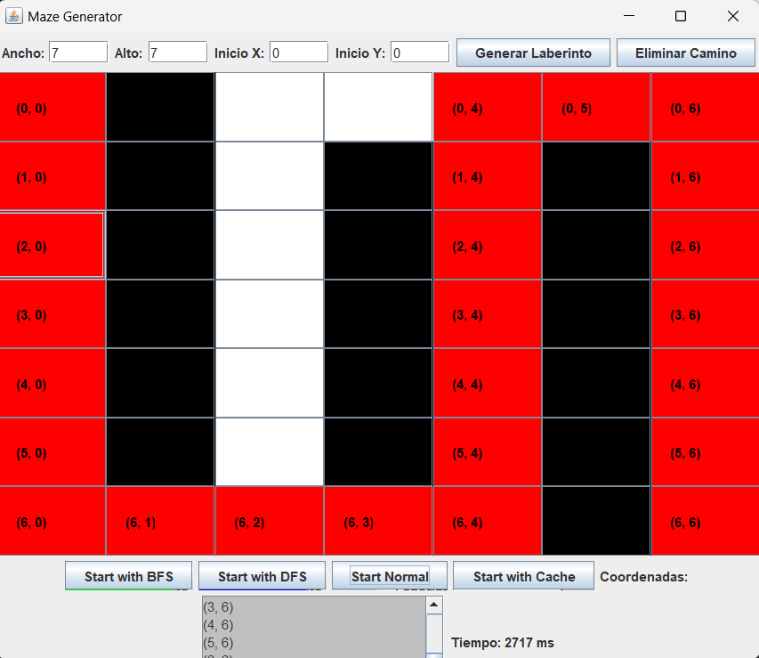
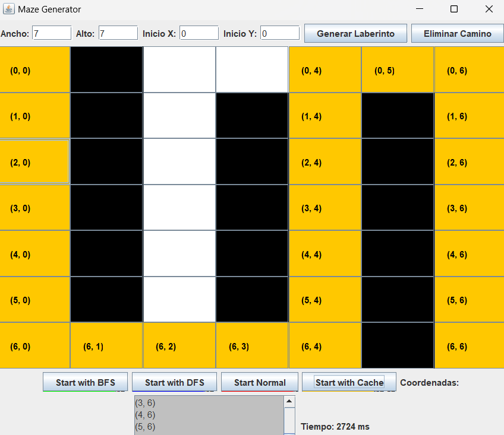
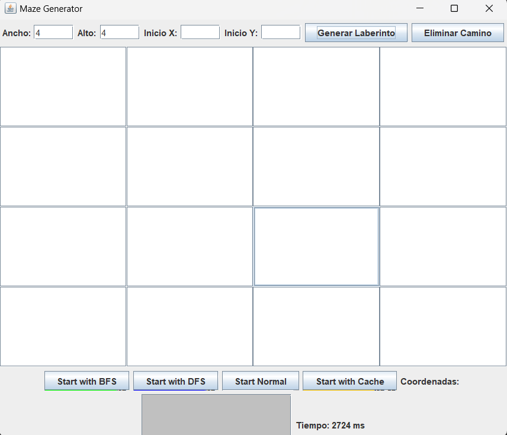
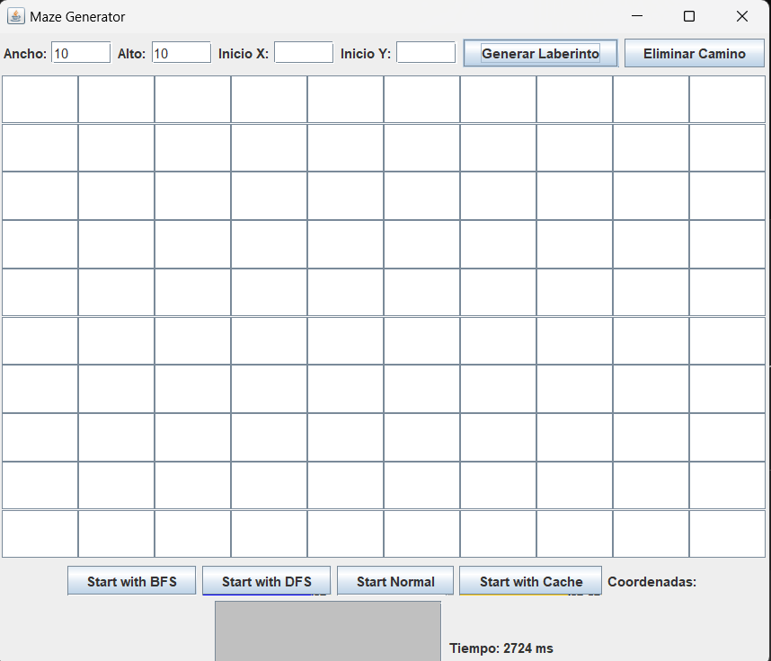

## Getting Started

Welcome to the VS Code Java world. Here is a guideline to help you get started to write Java code in Visual Studio Code.

## Folder Structure

The workspace contains two folders by default, where:

- `src`: the folder to maintain sources
- `lib`: the folder to maintain dependencies

Meanwhile, the compiled output files will be generated in the `bin` folder by default.

> If you want to customize the folder structure, open `.vscode/settings.json` and update the related settings there.

## Dependency Management

The `JAVA PROJECTS` view allows you to manage your dependencies. More details can be found [here](https://github.com/microsoft/vscode-java-dependency#manage-dependencies).

## PROYECTO FINAL

- INTEGRANTES: Josue Gallegos, Diego Avila.

La clase MazeGenerator es la encargada de manejar la interfaz gráfica y la lógica para interactuar con el laberinto. Se divide en varias secciones:

## Declaración de variables

Contiene elementos de la interfaz como:

- Campos de texto (JTextField) para ingresar el tamaño del laberinto y el punto de inicio.
- Botones (JButton) para generar el laberinto, limpiar caminos y resolverlo con diferentes algoritmos.
- Paneles (JPanel) para organizar los componentes de la interfaz.
- Etiquetas y área de texto (JLabel, JTextArea) para mostrar coordenadas y tiempo de ejecución.

## Constructor (MazeGenerator())

Configura la ventana principal (JFrame).
Agrega componentes de entrada, botones y paneles.
Asigna eventos a los botones para que ejecuten las funciones correspondientes.

## Generación del laberinto (generateGrid())

- Obtiene el ancho y alto ingresado por el usuario.
Inicializa el controlador del laberinto (LaberintoControlador).
- Crea una cuadrícula (JPanel) con botones (JButton) que representan las celdas.
- Permite marcar celdas como obstáculos con un clic.

## Borrar camino (clearPath())

-Restaura las celdas del laberinto eliminando cualquier camino pintado.
-Borra las coordenadas mostradas en el área de texto.

## Resolución del laberinto (startMazeGeneration(String mode))

- Obtiene la posición de inicio ingresada por el usuario.
- Verifica que el punto de inicio no sea un obstáculo.
- Ejecuta en segundo plano (SwingWorker) el algoritmo seleccionado (BFS, DFS, Normal o Cache).
- Muestra visualmente el camino recorrido con distintos colores y un retraso (Thread.sleep(100)) para simular la animación.
- Guarda y muestra las coordenadas de cada paso en un área de texto (JTextArea).
- Mide el tiempo de ejecución y lo muestra en una etiqueta.

## Interfaz Gráfica (Swing)

Se utiliza JFrame para la ventana principal y se organiza con BorderLayout.
Los componentes principales:

- Panel de entrada (JPanel inputPanel): Contiene campos de texto y botones.
- Panel de la cuadrícula (JPanel gridPanel): Representa el laberinto con una malla de botones.
- Panel de acciones (JPanel actionsPanel): Contiene los botones para iniciar los algoritmos y etiquetas para mostrar coordenadas y tiempo.

## Generación del Laberinto (generateGrid())

- Toma las dimensiones ingresadas.
- Crea una cuadrícula de botones (JButton), cada uno - representando una celda.
- Permite marcar obstáculos con el mouse:
- Clic en una celda blanca → Se convierte en un muro negro.
- Clic en una celda negra → Se vuelve a habilitar como celda vacía.

## Limpieza del Camino (clearPath())

- Verifica si hay un laberinto generado.
- Recorre todas las celdas y elimina cualquier rastro de caminos sin afectar los muros.
- Borra las coordenadas del área de texto.

## Ejecución de Algoritmos de Búsqueda

Cada vez que se presiona un botón de algoritmo (BFS, DFS, Normal, Cache), se ejecuta startMazeGeneration(String mode).

Pasos clave:

- Obtiene las coordenadas de inicio.
- Verifica que el punto de inicio no sea un obstáculo.
- Ejecuta en segundo plano (SwingWorker) el algoritmo correspondiente.
- Al encontrar un camino, lo pinta en la cuadrícula con un color específico.
- Muestra las coordenadas del camino en un área de texto.
- Calcula y muestra el tiempo de ejecución.

## Uso de SwingWorker para Animación

- doInBackground(): Ejecuta el algoritmo en un hilo separado.
process(List<int[]> chunks): Recibe y pinta los pasos del camino en tiempo real.
- done(): Muestra el tiempo total de ejecución y un mensaje indicando si se encontró un camino o no.

Resumen de Algoritmos Implementados:

- Los métodos solveBFS(), solveDFS(), solveNormal() y solveWithCache() pertenecen a LaberintoControlador (no incluido aquí, pero asumimos que tiene la lógica de cada algoritmo).

- Cada uno de estos algoritmos explora el laberinto para encontrar un camino desde la posición inicial hasta la última celda (width-1, height-1), y al encontrarlo, colorea las celdas recorridas.

## Colores usados en los caminos:

🟩 Verde → BFS (Anchura)

🔵 Azul → DFS (Profundidad)

🔴 Rojo → Método normal

🟠 Naranja → Método con caché

## Clase Puntos

Declara la clase Puntos, que almacenará una lista de coordenadas (x, y).

- puntosRecorridos → Es una lista (List<int[]>) de arreglos enteros donde cada elemento representa un punto (x, y).
- Uso de final → La referencia a la lista no puede cambiar, pero se pueden agregar o eliminar elementos dentro de la lista.
- new ArrayList<>() → Inicializa la lista vacía.

## Método agregarPunto(int x, int y)

- Recibe dos enteros X y Y que representan una coordenada en el recorrido.
- Guarda el punto (x, y) en la lista puntosRecorridos, almacenándolo como un arreglo {x, y}.
- Imprime el punto en la consola con System.out.println().

## Método getPuntosRecorridos()

- Devuelve la lista puntosRecorridos, permitiendo acceder a todos los puntos almacenados.

## Clase Celda

Este código define la clase Celda, la cual representa una celda dentro de un laberinto. Cada celda puede ser un obstáculo, un camino, o una parte de la solución del laberinto. También se le puede asignar un color para su representación visual.

- Declara la clase Celda, que almacenará información sobre si la celda es un obstáculo, parte del camino y su color.

## Atributos de la Clase

- estado → Indica si la celda es un obstáculo (true) o un espacio libre (false).
- esCamino → Indica si la celda forma parte del camino encontrado en la solución del laberinto.
- color → Permite asignar un - color a la celda para representarla gráficamente.

## Constructor de la Clase

- Recibe un parámetro estadoInicial (true o false).
- Inicializa estado con el valor proporcionado (true = obstáculo, false = libre).
- Inicializa esCamino en false, porque al inicio no forma parte de ningún camino.
- Inicializa color en null, porque aún no se ha asignado un color

## Obtener el estado de la celda

- Devuelve true si la celda es un obstáculo.
- Devuelve false si la celda es un espacio libre.

## Establecer el estado de la celda

- Permite cambiar el estado de la celda (obstáculo o espacio libre).

## Alternar el estado de la celda

- Si la celda es un obstáculo (true), la convierte en un espacio libre (false).
- Si la celda es un espacio libre (false), la convierte en un obstáculo (true).
- Se usa cuando el usuario hace clic en la celda para cambiar su estado.

## Marcar la celda como parte del camino

- true → La celda es parte del camino de solución del laberinto.
- false → La celda no es parte del camino.

## Verificar si la celda es parte del camino

- Devuelve true si la celda forma parte del camino.
- Devuelve false si no forma parte del camino.

## Verificar si la celda no ha sido visitada

- No es un obstáculo (estado == false)
- No forma parte del camino (esCamino == false)
- Se usa para saber si una celda puede ser explorada en la búsqueda de la solución

## Obtener el color de la celda

- Devuelve el color actual de la celda.

## Establecer el color de la celda

- Permite asignar un color a la celda

## Clase Laberinto

- celdas → Una matriz bidimensional de objetos Celda que representa el laberinto.
- ancho → Número de columnas del laberinto.
- alto → Número de filas del laberinto.

## Constructor de la Clase

- Inicializa ancho y alto con los valores proporcionados.
- Crea la matriz celdas con las dimensiones [alto][ancho].
- Llena la matriz con nuevas instancias de Celda, cada una inicializada como un espacio libre (false).

## Obtener la Matriz de Celdas

- Devuelve la matriz completa de celdas del laberinto.

## Obtener el Ancho del Laberinto

- Devuelve el número total de columnas del laberinto.

## Obtener el Alto del Laberinto

- Devuelve el número total de filas del laberinto.

## Obtener una Celda en una Posición Específica

- Verifica si la posición está dentro de los límites del laberinto.
- Si es válida, devuelve la celda en esa posición.
- Si es inválida, lanza una excepción IndexOutOfBoundsException con un mensaje de error.

## Alternar el Estado de una Celda

- Verifica si la posición está dentro de los límites del laberinto.
- Si es válida, cambia el estado de la celda en esa posición (de obstáculo a libre o viceversa).
- Si es inválida, lanza una excepción IndexOutOfBoundsException.

## Clase LaberintoContrlador

La clase LaberintoControlador se encarga de manejar la lógica del laberinto, incluyendo la modificación de celdas y la búsqueda de caminos usando diferentes algoritmos (BFS, DFS y BFS con caché).

Se utiliza en conjunto con las clases Laberinto y Celda, permitiendo resolver el laberinto con distintos enfoques.

- laberinto → Representa el laberinto que se controla.
- path → Almacena la secuencia de celdas que forman la ruta desde el inicio hasta el final.

- Crea una instancia del laberinto con las dimensiones especificadas.
- Inicializa la lista path que guardará la solución encontrada
- Devuelve el objeto Laberinto que contiene la matriz de celdas.
- Cambia entre obstáculo (true) y camino libre (false) en la celda dada.

## Algoritmo BFS (Breadth-First Search - Búsqueda en Anchura)

 ## ¿Cómo funciona?

- Usa una cola queue para recorrer el laberinto por niveles.
- Guarda los padres de cada celda en parentMap para reconstruir el camino después.
- Si encuentra la celda final, reconstruye el camino y retorna true.

## Algoritmo DFS (Depth-First Search - Búsqueda en Profundidad)

## ¿Cómo funciona?

- Usa una pila stack para recorrer en profundidad primero.
- Similar a solveBFS, pero explora un camino hasta el fondo antes de retroceder.

## Búsqueda Normal (BFS)

Simplemente llama a solveBFS() como método por defecto.

## BFS con Caché (Optimizado)

## ¿Cómo funciona?

- Usa un Set<String> como caché para evitar explorar la misma celda más de una vez

- Es similar a solveBFS(), pero más eficiente

## Reconstrucción del Camino

 ## ¿Qué hace?

- Usa el parentMap para reconstruir la ruta desde el final hasta el inicio.
- Invierte el camino (Collections.reverse()) para que esté en orden correcto

## Obtener el Camino Encontrado

- Devuelve la lista de celdas en la ruta encontrada

## Marcar el Camino con un Color

- Colorea todas las celdas en el camino encontrado con el color especificado.

## Marcar una Celda como Obstáculo

- Convierte una celda en un obstáculo (true).

## Eliminar un Obstáculo

- Convierte una celda en camino libre (false).

## CONCLUSION

Los códigos implementados permiten la creación, manipulación y resolución de un laberinto utilizando diferentes enfoques algorítmicos. Este sistema está bien estructurado en varias clases, cada una con una responsabilidad específica, lo que lo hace modular, escalable y fácil de entender.

## 1️. Laberinto

- Representa la estructura de la cuadrícula donde se almacenan las celdas.
- Permite acceder y modificar cada celda individualmente.

## 2. Celda

- Representa una celda dentro del laberinto.
- Puede ser un obstáculo o un camino libre.
- Tiene métodos para cambiar su estado y color.

## 3️. LaberintoControlador

- Es el núcleo de la lógica: permite modificar el laberinto y buscar rutas.
- Implementa los algoritmos BFS (anchura), DFS (profundidad) y BFS con caché para resolver el laberinto.
- Puede marcar obstáculos y reconstruir caminos.

Este proyecto demuestra un buen uso de estructuras de datos y algoritmos de búsqueda aplicados a la resolución de laberintos. Su modularidad permite futuras expansiones y optimizaciones, convirtiéndolo en una excelente base para aplicaciones más avanzadas en inteligencia artificial y simulaciones.
